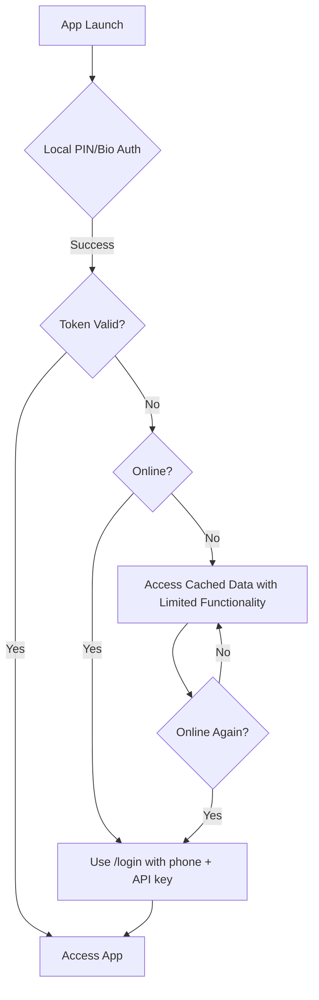

# Passwordless Authentication Proposal for VimbisoPay

## Executive Summary

This proposal outlines a transition from our current password-based authentication to a passwordless approach using WhatsApp verification combined with local device authentication (PIN/biometrics). This change will simplify user experience while enhancing security, particularly for users who struggle with password management.

## Current Authentication System & Limitations

Our current system requires phone number and password for login, with WhatsApp verification only for registration and password reset. This approach has several drawbacks:

- **Poor User Experience**: Users struggle with creating, remembering, and entering complex passwords
- **Security Vulnerabilities**: Weak passwords and password reuse expose accounts to risk
- **Support Burden**: Password reset requests create overhead
- **Redundant Security**: We already verify identity via WhatsApp, which enables password reset, making passwords an unnecessary layer
- **Implementation Complexity**: Maintaining password-related code and flows adds development overhead

## Proposed Passwordless Authentication

### Authentication Flow

### Key Components

1. **Initial Authentication**: WhatsApp verification + one-time setup of local PIN/biometrics
2. **Daily Access**: PIN/biometric authentication only (no password)
3. **Token Management**: Use `/login` endpoint (phone + API key) for token refresh
4. **Offline Access**: PIN/biometric authentication works offline with access to cached data

## Benefits

### Enhanced Security

- **True Multi-Factor Authentication**: Combines possession (phone with WhatsApp, or other access to your WhatsApp number) with knowledge/biometric factors (PIN/fingerprint/face)
- **Reduced Attack Surface**: Eliminates password database breaches, reset flow exploits, and credential reuse
- **Resistance to Common Attacks**: Mitigates phishing, credential stuffing, and brute force attacks

### Improved User Experience

- **Frictionless Onboarding**: No need to create and remember complex passwords
- **Fast Daily Access**: Quick authentication via PIN/biometrics without typing passwords
- **Eliminated Password Frustrations**: No more forgotten passwords or reset flows
- **Enhanced Accessibility**: Reduced cognitive load and fewer input errors

### Business Benefits

- **Reduced Support Costs**: Fewer password reset requests and authentication issues
- **Increased User Satisfaction**: Smoother experience leads to higher engagement
- **Simplified Codebase**: Less authentication-related code to maintain
- **Modern Security Posture**: Alignment with industry best practices

## Implementation Plan

### Phase 1: Foundation
- Replace all instances where password is required with WhatsApp verification
- Ensure authentication flows use PIN/biometric systems
- Modify token refresh to use `/login` endpoint instead of password-based authentication
- Remove password fields from UI and update messaging

### Phase 2: Security Enhancements
- Implement API key protection and certificate pinning
- Add server-side rate limiting and anomaly detection
- Enhance WhatsApp verification for sensitive operations

### Phase 3: Rollout
- Internal testing and beta testing
- Full deployment with monitoring of authentication metrics

## Risk Mitigation

| Risk | Mitigation Strategy |
|------|---------------------|
| API key compromise | Implement key obfuscation, certificate pinning, and server-side monitoring |
| Device loss/theft | Rely on device security, implement remote logout capability and timeout |
| WhatsApp account compromise | Add verification for suspicious activities, implement account recovery |
| Offline access issues | Robust offline capabilities with clear status indicators |

## Conclusion

Transitioning to passwordless authentication offers significant usability improvements and enhances security while reducing support burden and removing redundant code and user flows. By leveraging our existing WhatsApp integration and device security features, we can create a more seamless and secure experience that aligns with modern authentication best practices.

## Next Steps

1. Review and approve this proposal
2. Assign resources and develop detailed technical specifications
3. Begin implementation
