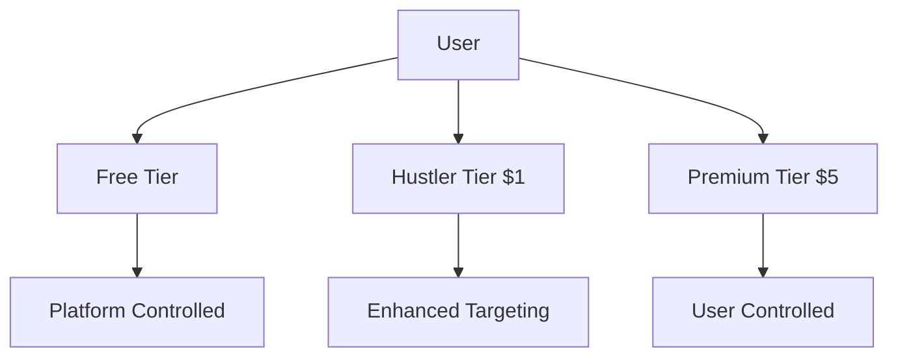
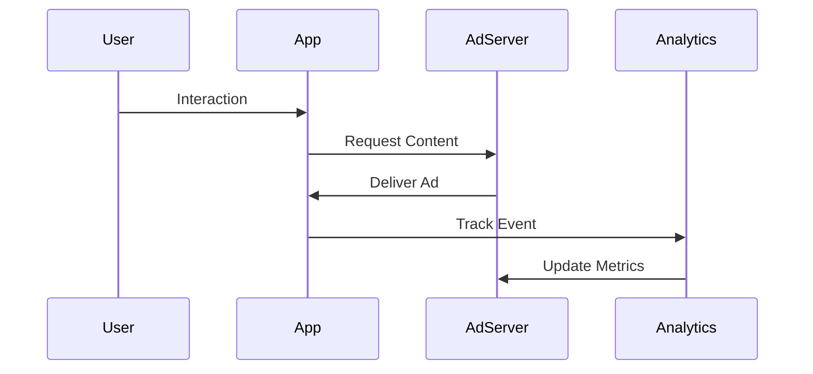

# System Overview

## Core Components

### 1. Tier Management


### 2. Ad Space Control
- Free Tier: Platform managed
- Hustler Tier: Enhanced targeting
- Premium Tier: Full user control

### 3. Revenue Distribution
```
Premium Tier ($5)
├── User Share: 70%
├── Platform Fee: 25%
└── Operating Costs: 5%

Hustler Tier ($1)
├── User Share: 10%
├── Platform Fee: 80%
└── Operating Costs: 10%

Free Tier
├── Platform Fee: 90%
└── Operating Costs: 10%
```

## User Experience Flow

### 1. Regular Users
```
Transaction Flow
└── Non-intrusive ad placement
    ├── Between transactions
    ├── Dashboard idle state
    └── Post-transaction completion
```

### 2. Business Users
```
Business Portal
├── Campaign Management
│   ├── Ad Creation
│   ├── Targeting Setup
│   └── Budget Control
├── Performance Analytics
│   ├── Engagement Metrics
│   ├── ROI Tracking
│   └── Audience Insights
└── Revenue Management
    ├── Billing
    ├── Revenue Share
    └── Payout Processing
```

## Integration Points

### 1. External Systems
```
Third-Party Integration
├── Kevel Ad Server
│   ├── Content Delivery
│   ├── Targeting Engine
│   └── Analytics API
├── Payment Processing
│   ├── Revenue Distribution
│   ├── Automated Payouts
│   └── Transaction Tracking
└── Analytics Platform
    ├── Performance Metrics
    ├── User Behavior
    └── Business Intelligence
```

### 2. Internal Systems
```
App Integration
├── Transaction System
│   ├── Event Triggers
│   ├── User Context
│   └── Activity Tracking
├── User Management
│   ├── Tier Control
│   ├── Permissions
│   └── Settings
└── Content Management
    ├── Ad Storage
    ├── Delivery Rules
    └── Cache System
```

## System Architecture Overview

### 1. Frontend Components
```
UI Components
├── Ad Display Widgets
├── Business Portal
├── User Controls
└── Analytics Dashboard
```

### 2. Backend Services
```
Core Services
├── Ad Management
├── User Management
├── Analytics Engine
└── Payment Processing
```

### 3. Data Flow


## Key Features

### 1. User Controls
- Custom targeting preferences
- Content filtering
- Revenue tracking
- Performance analytics

### 2. Business Tools
- Campaign creation
- Audience targeting
- Performance monitoring
- Budget management

### 3. Platform Management
- Content moderation
- Revenue distribution
- System monitoring
- Performance optimization

## Performance Metrics

### 1. User Engagement
- View duration
- Interaction rate
- Conversion tracking
- User satisfaction

### 2. Business Performance
- Campaign ROI
- Audience reach
- Engagement rates
- Cost per acquisition

### 3. System Performance
- Load times
- Response rates
- Error rates
- System uptime

## Security Measures

### 1. Data Protection
- Encryption at rest
- Secure transmission
- Access control
- Audit logging

### 2. Privacy Controls
- User consent management
- Data minimization
- Transparency controls
- Privacy settings

### 3. System Security
- Authentication
- Authorization
- Rate limiting
- Fraud detection

## Scalability Considerations

### 1. Technical Scaling
- Horizontal scaling
- Load balancing
- Caching strategy
- Database optimization

### 2. Business Scaling
- Market expansion
- Feature addition
- User base growth
- Revenue scaling

### 3. Operational Scaling
- Support systems
- Content moderation
- Payment processing
- Analytics processing
