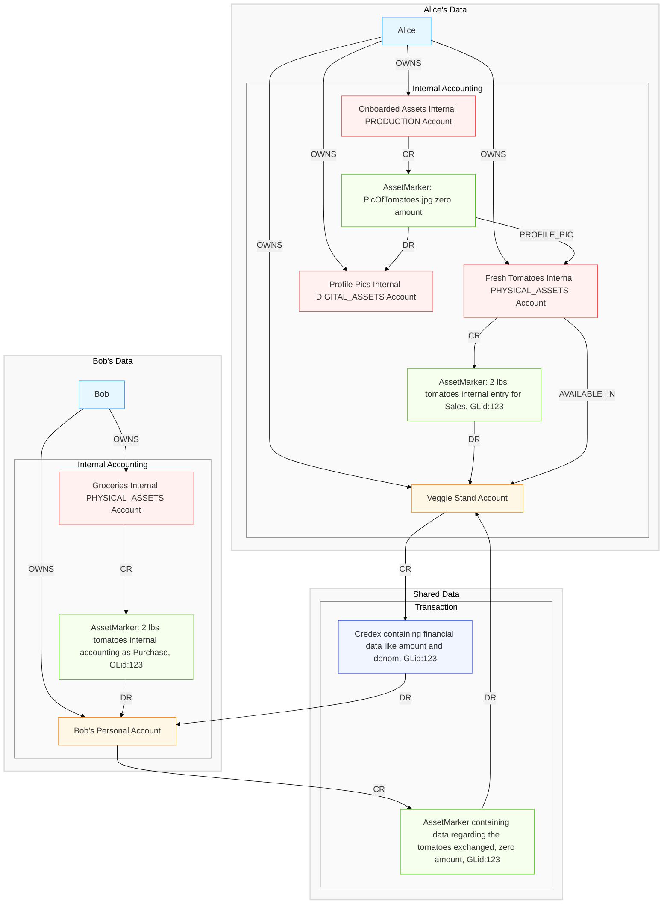

# VimbiSoPay Architecture

This document outlines the core architecture of the VimbiSoPay system, a networked ledger built on a graph database that facilitates secure transactions, ownership tracking, and marketplace functionality.

## Core Domain Model

The VimbiSoPay system is built around the following core domain entities and relationships:

## Entities and Relationships

### Members and Companies

- **Members** are primary entities.
- **Companies** are similar to members but are owned by one or more members via shares.
- **Entities** refers to members and companies
- **Shares** are owned by entities.
- Ownership chains can be calculated to determine the ultimate member ownership percentages of any company.

### Accounts and Transactions

- **Accounts** are owned by entities.
- Accounts transact with each other through **Credex** (Ledger Entries) in an Account-CR→LedgerEntry-DR→Account pattern.
- An account's balance is the net of its CR and DR LedgerEntries with other accounts.
- The system enforces that the net balance across all accounts is always zero.

### Account Management and Delegation

- Entities can delegate management of their accounts to any member, except that no member may delegate their Personal Account.
- Delegated managers become responsible to the account owner for actions they authorize.
- The account owner retains ultimate responsibility for the account.
- This delegation enables employees and contractors to act on behalf of a company for specific accounts.

### Internal Accounting

- **AccountInternals** are owned by entities and can transact with other AccountInternals owned by the same entity.
- They follow an AccountInternal-CR→LedgerEntry-DR→AccountInternal pattern.
- Like regular accounts, the net balance between all AccountInternals must be zero.
- These internal ledger entries are called **AssetMarkers**.

### GLid System

- A **GLid** (General Ledger ID) can be assigned to a Credex and is always assigned to an AssetMarker.
- GLids are unique per Credex but non-unique among internal entries.
- A single GLid can be assigned to multiple AssetMarkers, but all entries assigned to a single GLid must net to zero against the single Credex.
- This ensures that if every Credex in every account owned by an entity has a GLid, their books are balanced to the shared ledger.

### Digital Assets

- **AssetMarkers** can contain any data and can have zero amounts to avoid impacting account balances.
- Account-CR→AssetMarker-Account patterns are permitted with zero amounts when accounts are owned by different entities.
- This mechanism enables passing messages and digital assets between entities.
- When assigned a GLid, the data becomes associated with the Credex and with the linked internal entries of each entity.
- This can be used to pass digital assets with Credex payments or information about physical assets (serial numbers, manuals, warranties, etc.).
- When passed with a GLid, the appropriate CR/DR pattern for the AssetMarker is opposite to the credex. Real value flows in the AssetMarker (or is represeted by the marker), while the credex is the associated financial liability that passes the other direction in payment.
- Payment data is stored on the credex, asset data is stored on the marker.

## Responsibility and Credit Ratings

- Members bear responsibility for the activities of companies based on their percentage of ownership.
- Members have their own credit ratings.
- Companies have their own credit ratings.
- Members bear responsibility for the defaults of companies based on their percentage of ownership.
- This ultimate responsibility of specific members can also be sumarized in a rating or traced in specific detail.
- This creates a chain of responsibility and reputation throughout the system.

## Marketplace Functionality

- When an AccountInternal has an **AVAILABLE_IN** relationship to an Account, data on that AccountInternal is made available for other members to find.
- The AccountInternal then becomes a **Product** in the marketplace, where members can find it in search, browse, etc.
- AssetMarkers contain the full underlying data, which can be summarized on the AccountInternal for marketing purposes.
- AccountInternal shared data can expand to become full websites, videos, etc.

## Key System Rules

1. **Zero-Sum Ledger**: The net balance between all accounts is always zero.
2. **Ownership Transparency**: All companies are ultimately owned by specific members in calculable ratios.
3. **Responsibility Chain**: Members bear responsibility for company activities based on ownership percentage.
4. **Balanced GLids**: All entries assigned to a single GLid must net to zero against the associated Credex.
5. **Delegation with Responsibility**: Account management can be delegated, but ultimate responsibility remains with the owner(s).
